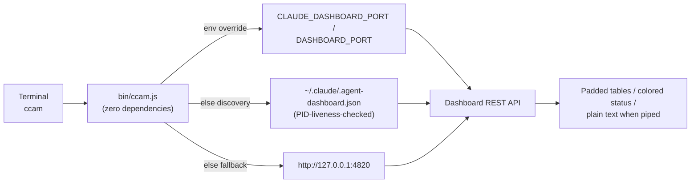

# `ccam` CLI Reference

The complete guide to `ccam`, the Claude Code Agent Monitor command-line interface — the full dashboard feature surface, in your terminal.

---

## Table of Contents

- [Overview](#overview)
- [Installation & Linking](#installation--linking)
- [Server Discovery](#server-discovery)
- [Commands](#commands)
  - [Monitoring](#monitoring)
  - [Data Browsing](#data-browsing)
  - [Insights](#insights)
  - [Alerts & Webhooks](#alerts--webhooks)
  - [Pricing](#pricing)
  - [Import](#import)
  - [Administration](#administration)
- [Safety Model](#safety-model)
- [Output & Scripting](#output--scripting)
- [Troubleshooting](#troubleshooting)

---

## Overview

`ccam` (`bin/ccam.js`) is a **dependency-free** Node.js CLI over the local dashboard API. Everything the web app can do — monitoring, browsing, analytics, alerting, pricing, imports, administration — is available as a terminal command. It ships with the repository, requires no additional install step beyond the normal project setup, and talks only to your local dashboard server.

```
ccam <command> [options]
```



## Installation & Linking

`npm run setup` ends with a fail-soft `npm link` (the `link-cli` script), so after a normal local setup `ccam` is on your PATH from any directory:

```bash
git clone https://github.com/hoangsonww/Claude-Code-Agent-Monitor.git
cd Claude-Code-Agent-Monitor
npm run setup     # installs deps AND links ccam globally
ccam help
```

If linking needed elevated permissions in your environment, setup still succeeds and prints a hint — run `npm link` once from the repo root yourself, or invoke the CLI directly with `node bin/ccam.js <command>`.

## Server Discovery

The CLI finds your running dashboard the same way the Claude Code hook handler does:

| Priority | Source | Notes |
| -------- | ------ | ----- |
| 1 | `CLAUDE_DASHBOARD_PORT` / `DASHBOARD_PORT` env vars | Explicit override wins |
| 2 | `~/.claude/.agent-dashboard.json` | Written by every running dashboard (`{port, pid, startedAt}` entries); stale entries are skipped via a PID liveness check |
| 3 | `http://127.0.0.1:4820` | Default port fallback |

If no server answers, every API-backed command exits `1` with the `○ Dashboard server is NOT running` indicator and the ways to start one (see [Server Lifecycle](#server-lifecycle)).

## Commands

### Server Lifecycle

The CLI talks to the local dashboard server — **API-backed commands require it to be running**. When it isn't, every such command prints a consistent indicator and exits `1`:

```
○ Dashboard server is NOT running (tried http://127.0.0.1:4820)
  This command needs the server. Start it with one of:
    ccam start        # production server in the background
    npm run dev       # dev mode (hot reload), foreground
    npm start         # production mode, foreground
```

| Command | Description |
| ------- | ----------- |
| `ccam status` | At-a-glance up/down indicator (`●` running / `○` not running); exits `1` when down |
| `ccam start [--port N]` | Start the production server **in the background** (detached; survives closing the terminal), wait up to 30 s for `/api/health`, print the URL + PID and the `kill <pid>` stop command. Logs append to `data/ccam-server.log`. No-ops with a pointer when a server is already up. Requires a built client (`npm run build` once) |

### Monitoring

| Command | Description |
| ------- | ----------- |
| `ccam health` | One-line reachability check with the resolved URL and server timestamp |
| `ccam stats` | Totals (sessions, agents, events), today's event count, WS connections, and the sessions-by-status distribution |
| `ccam kanban` | The Kanban board as text: sessions grouped into Active / Waiting / Completed / Error / Abandoned and agents into Working / Waiting / Completed / Error, with current tools |
| `ccam tail [--session <id>]` | Live event feed — polls `/api/events` every 2 s and prints only new rows (the Activity Feed without a WebSocket client). `Ctrl+C` stops |

### Data Browsing

| Command | Description |
| ------- | ----------- |
| `ccam sessions [--status s] [--q text] [--limit n]` | Server-filtered session table: short ID, status, name, agent count, duration, model |
| `ccam session <id>` | Deep dive: metadata line, per-session cost, an indented parent→child **agent tree** with live tools, and the most recent events |
| `ccam agents [--status s] [--session id] [--limit n]` | Agent table with type, current tool, and duration |
| `ccam events [--session id] [--limit n]` | Newest-first event log with type, tool, and summary |

### Insights

| Command | Description |
| ------- | ----------- |
| `ccam analytics` | Token totals (input / output / cache read / cache write), top tools by call count, agent-type distribution, average events per session |
| `ccam workflows [--session id]` | Workflow-intelligence stats (sessions analyzed, subagents, success rate, depth, compactions) and the top detected patterns; `--session` drills into one session |
| `ccam runs [--session id]` | Dynamic Workflow-tool runs: status, agent count, tokens, tool calls, duration |
| `ccam cost` | Total estimated cost with the per-model breakdown |

### Alerts & Webhooks

| Command | Description |
| ------- | ----------- |
| `ccam alerts [--unacked] [--limit n]` | Fired-alert feed with state, trigger time, rule, and message |
| `ccam alerts ack <id>` | Acknowledge one alert |
| `ccam alerts ack-all` | Acknowledge every unacknowledged alert |
| `ccam rules` | Alert rules with enabled state, type, and cooldown |
| `ccam webhooks` | Webhook targets (URLs masked server-side, secrets never returned) |
| `ccam webhooks test <id>` | Fire a synthetic test alert at a target and report the delivery result; exits non-zero on failure |

### Pricing

| Command | Description |
| ------- | ----------- |
| `ccam pricing` | All model pricing rules with per-mtok rates |
| `ccam pricing set <pattern> --input N --output N [--cache-read N] [--cache-write N] [--name label]` | Create or update a rule (SQL `LIKE` pattern, e.g. `claude-opus-4-6%`) |
| `ccam pricing delete <pattern>` | Delete a rule |
| `ccam pricing reset` | Restore the default rate table |

### Import

| Command | Description |
| ------- | ----------- |
| `ccam import rescan` | Re-scan the default `~/.claude/projects` tree (idempotent; prints imported / backfilled / skipped / errors) |
| `ccam import path <dir>` | Recursively import every `.jsonl` under an absolute directory (`~` is expanded server-side) |

### Administration

| Command | Description |
| ------- | ----------- |
| `ccam doctor` | Diagnosis: API reachability, hook installation status + path, database path/size/row counts, server uptime and Node version, WS connections |
| `ccam info` | The raw `/api/settings/info` JSON (pipe it to `jq`) |
| `ccam export [file.json]` | Full JSON data export (sessions, agents, events, tokens, pricing) — defaults to a dated filename |
| `ccam cleanup --hours N --days M` | Abandon active sessions idle for `N` hours and/or purge completed sessions older than `M` days |
| `ccam reinstall-hooks` | Rewrite the Claude Code hook entries in `~/.claude/settings.json` |
| `ccam clear-data --yes` | Delete **all** data (schema preserved). Refuses to run without `--yes` |
| `ccam open` | Open the dashboard in your default browser (`open` / `xdg-open` / `start`) |
| `ccam help` | Full command reference (also shown with no arguments) |

## Safety Model

- **Read commands are always safe** — they only issue `GET`s.
- **Mutating commands** (`alerts ack`, `pricing set/delete/reset`, `import`, `cleanup`, `reinstall-hooks`) map 1:1 to explicit dashboard actions and run immediately, exactly like clicking the equivalent button.
- **The one destructive command, `clear-data`, refuses to run without `--yes`** and prints exactly what it would delete. There is no bulk-destructive behavior anywhere else.

## Output & Scripting

- Tables are plain text padded to the widest cell; status values are color-coded (green working/active, yellow waiting, red error, dim terminal states).
- **ANSI colors are disabled automatically when stdout is not a TTY**, so `ccam sessions | grep error` and `ccam info | jq .db.counts` behave.
- Exit codes: `0` success, `1` for unreachable server, API errors, usage errors, unknown commands, or a failed `webhooks test` — safe to use in scripts and CI.

## Troubleshooting

| Symptom | Fix |
| ------- | --- |
| `○ Dashboard server is NOT running` | Start it: `ccam start` (background), `npm run dev`, or `npm start`. If it runs on a custom port, set `DASHBOARD_PORT` or rely on the discovery file |
| `ccam: command not found` | Run `npm link` from the repo root (setup's fail-soft link may have skipped on permissions), or use `node bin/ccam.js …` |
| Wrong server answers (multiple dashboards) | Set `CLAUDE_DASHBOARD_PORT` explicitly — env overrides always beat discovery |
| `tail` shows nothing | Events only flow while hooks are installed and a Claude Code session is active — check `ccam doctor` |
